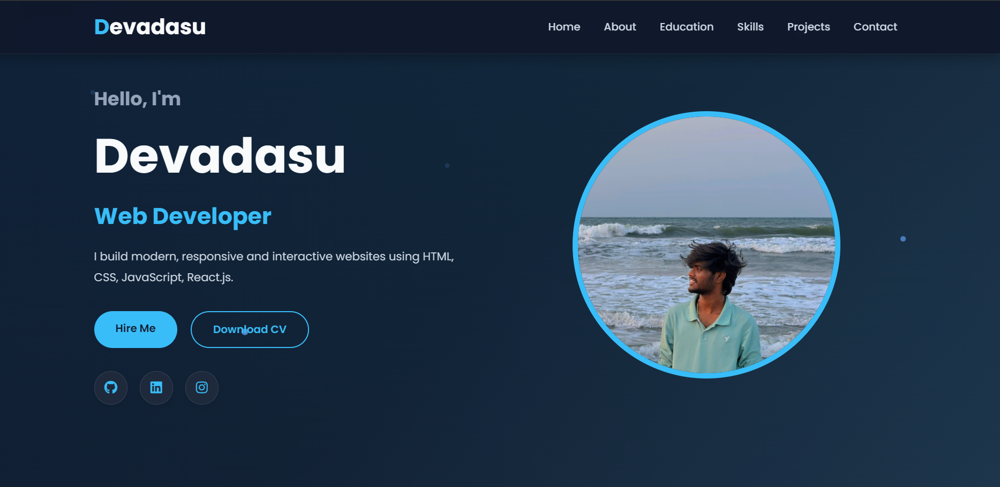
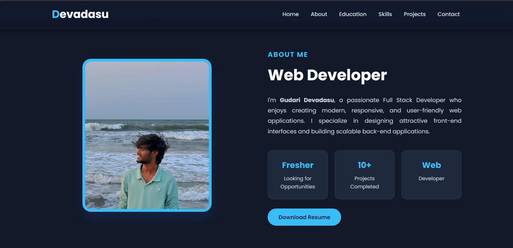
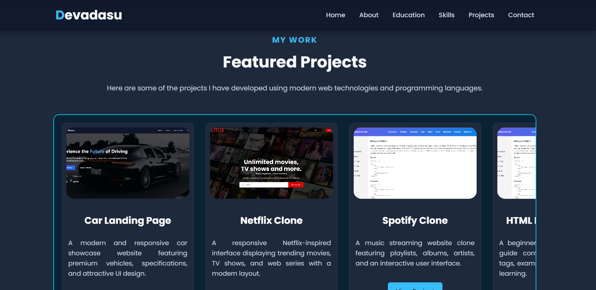
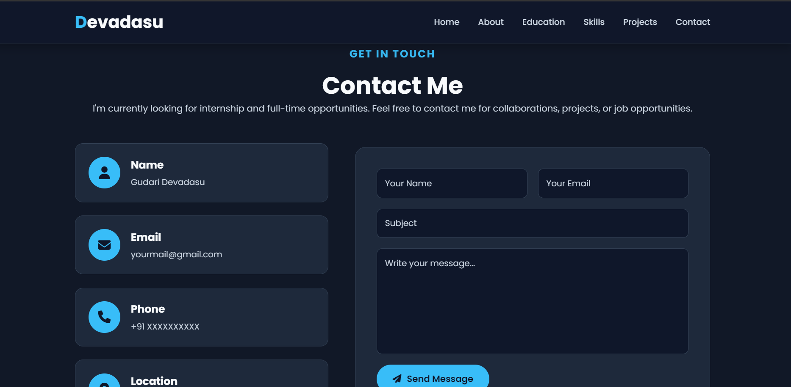

# 🌐 Personal Portfolio Website

A modern, responsive, and interactive personal portfolio website built using **HTML5** and **CSS3**. This portfolio showcases my skills, education, projects, and contact information with a clean UI and smooth animations.

---

## 🚀 Live Demo

Live : https://devadas-portfolio.netlify.app/

---

# 📸 Website Preview

## Home Page



---

## About Section



---

## Projects Section



---

## Contact Section



---

# ✨ Features

- Responsive Design
- Modern Dark Theme
- Smooth Scrolling Navigation
- Animated Hero Section
- Attractive Hover Effects
- Skills Section
- Education Timeline
- Projects Showcase
- Contact Form
- Social Media Links
- Download Resume Button

---

# 🛠 Technologies Used

- HTML5
- CSS3
- Font Awesome Icons
- Google Fonts (Poppins)

---

# 📂 Sections Included

- Home
- About
- Education
- Skills
- Projects
- Contact
- Footer

---

# 💼 Projects Showcased

- 🚗 Car Landing Page
- 🎬 Netflix Clone
- 🎵 Spotify Clone
- 📖 HTML Reference Page
- 📱 Mobile Landing Page
- 🧊 3D Cube
- 🎨 CSS Sibling Selector
- 💡 Tooltip Component
- 🍽 Restaurant Landing Page

---

# 📁 Project Structure

```
Portfolio/
│
├── index.html
├── style.css
├── README.md
│
└── images/
    ├── Deva.jpeg
    ├── favicon.png
    ├── landing-page.png
    ├── netflix.png
    ├── html-reference-page.png
    ├── mobile-landing-page.png
    ├── 3d-cube.png
    ├── sibling-selector.png
    ├── tooltip.png
    ├── restaurant.png
    ├── portfolio-home.png
    ├── portfolio-about.png
    ├── portfolio-projects.png
    └── portfolio-contact.png
```

---

# ⚙️ Installation

1. Clone the repository

```bash
git clone https://github.com/yourusername/portfolio.git
```

2. Open the project folder

```bash
cd portfolio
```

3. Open `index.html` in your browser.

---

# 📱 Responsive Design

This portfolio is fully responsive and optimized for:

- Mobile Devices
- Tablets
- Laptops
- Desktop Screens

---

# 🎯 Future Improvements

- Add JavaScript animations
- Dark/Light Theme Toggle
- Project Filtering
- Blog Section
- Backend Contact Form
- Email Integration
- React Version

---

# 👤 Author

**Gudari Devadasu**

Frontend Developer

GitHub:
https://github.com/DevadasuGudari

LinkedIn:
https://www.linkedin.com/in/gudari-devadasu-81141130a/

---

# ⭐ Support

If you like this project, don't forget to give it a ⭐ on GitHub.

---

© 2026 Gudari Devadasu. All Rights Reserved.
